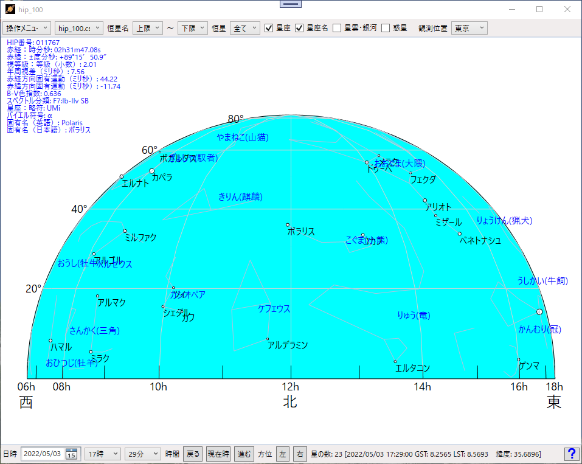
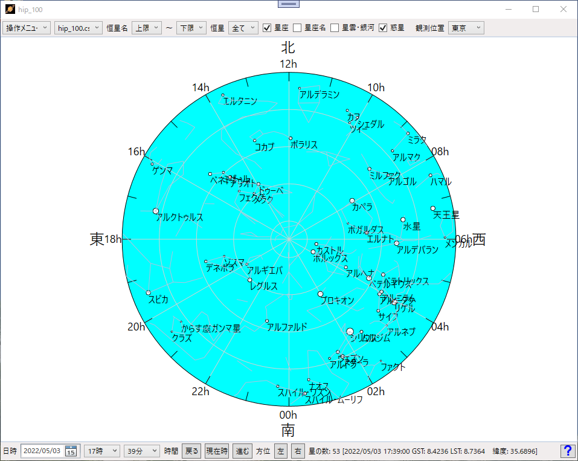
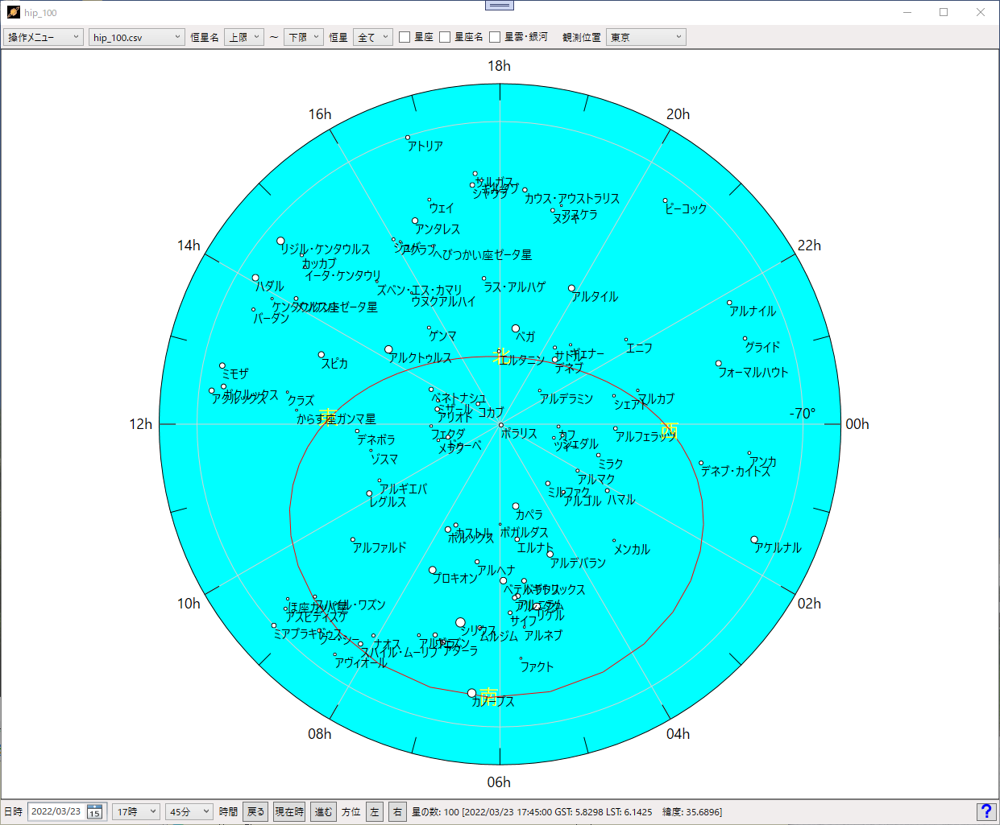
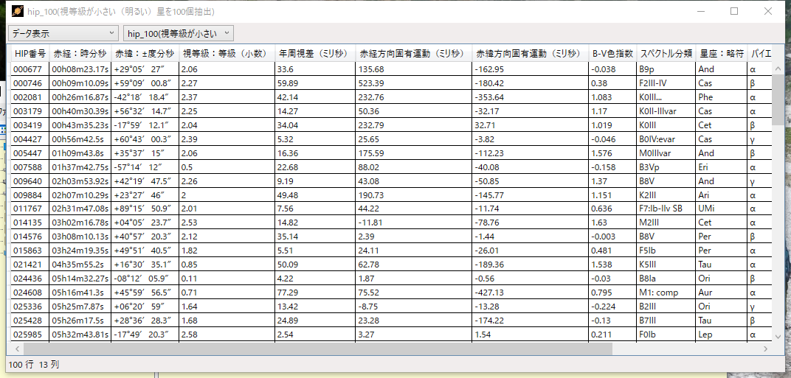
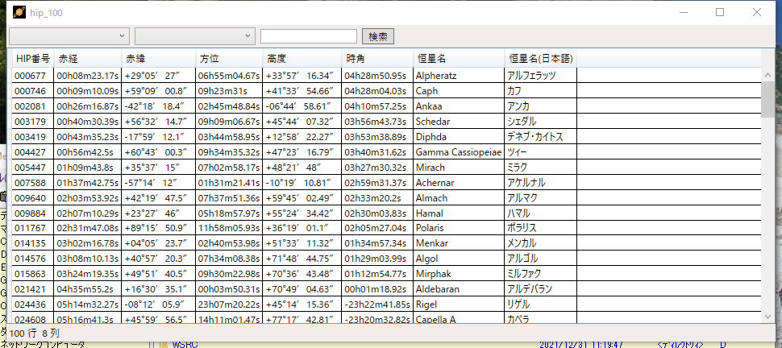
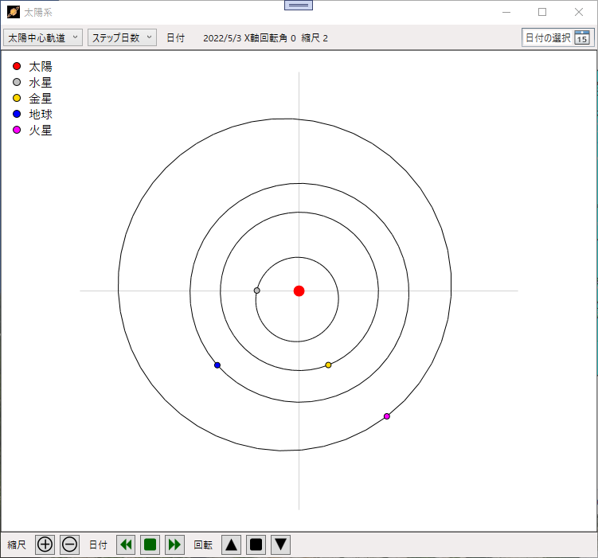
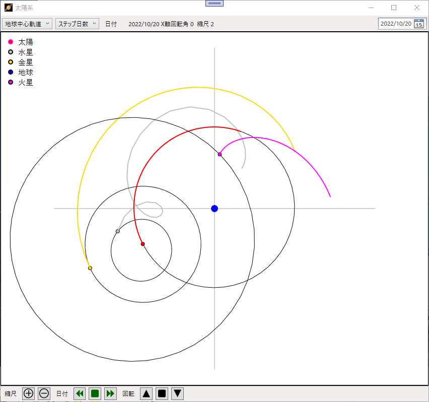
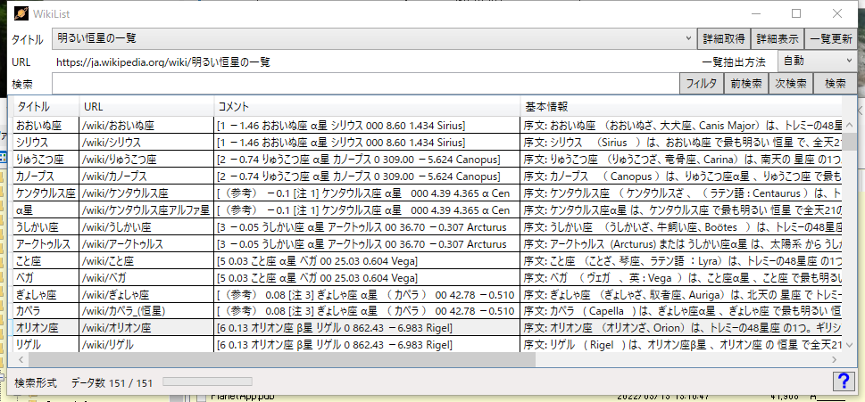

# PlanetApp
## シンプルなプラネタリウムソフト

#### ■おもな機能
Web上にある恒星データや理科年表、天文年鑑に載っているデータをもとに恒星や星座、星雲・銀河、惑星を表示する。  
1) 表示する恒星データの切替  
2) 恒星、星座、星雲、惑星、天の川の表示切替(天の川の表示には数秒かかる)  
3) 恒星位置でマウスの右クリックで恒星データを表示
4) 東西南北の半円表示
5) 円状に全天を表示
6) 星座早見盤を模した全恒星データの表示
7) 太陽系の惑星の軌道表示
8) 地球を中心とした太陽系惑星の軌道表示
9) 恒星データを表形式で表示
10) 表示されている恒星の地平座標系データを表形式で表示

起動画面 (東西南北表示)  
  

全天表示  
  

星座早見盤型式の表示  
  

恒星データの表示  
  

表示中の恒星データの地平座標の表示  
  

太陽系惑星の軌道表示  
  
太陽系の惑星の軌道を地球を中心にして表示  
  
Wikipediaの天体に関する情報の取得と表示  
  

### ■実行環境
PlanetApp.zipをダウンロードして適当なフォルダに展開し、フォルダ内の PlanetApp.exe をダブルクリックして実行します。  
動作環境によって「.NET 6.0 Runtime」が必要になる場合もあります。  
https://dotnet.microsoft.com/ja-jp/download/dotnet/thank-you/runtime-6.0.5-windows-x64-installer

### ■開発環境  
開発ソフト : Microsoft Visual Studio 2022  
開発言語　 : C# 9.0 Windows アプリケーション  
フレームワーク　 :  .NET 6.0  
NuGetライブラリ : なし  
自作ライブラリ  : CoreLib

・Git 初期化  
git init  
git add README.md  
git commit -m "first commit"  
git branch -M main  
git remote add origin https://github.com/katsushigeyoshida/PlanetApp.git  
git push -u origin main  
